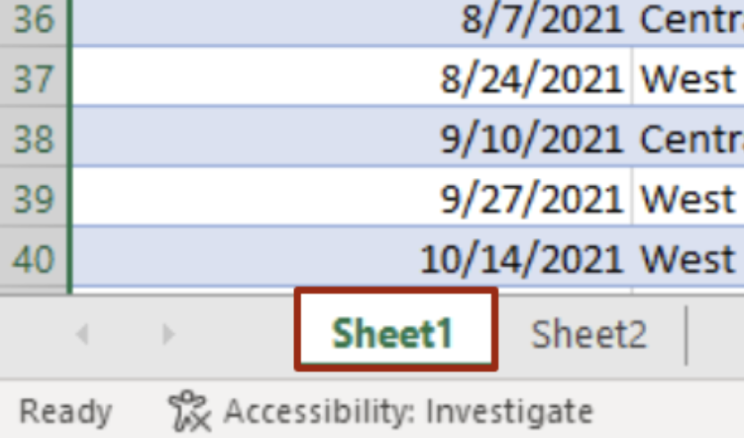
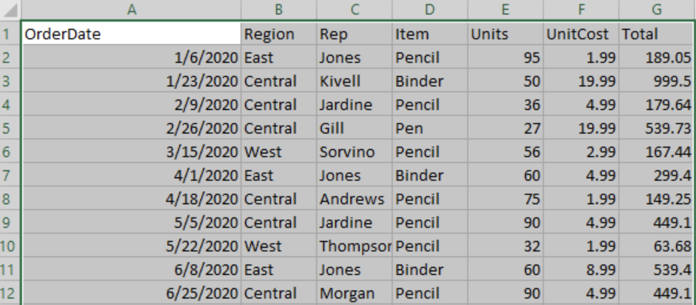
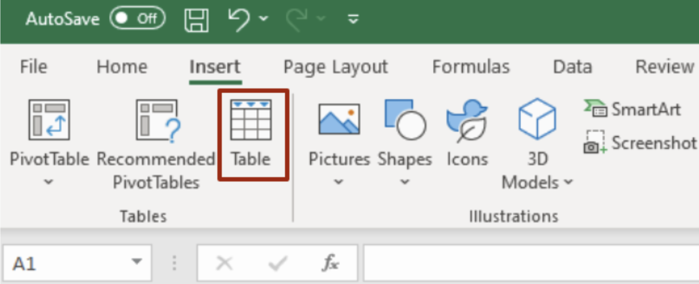
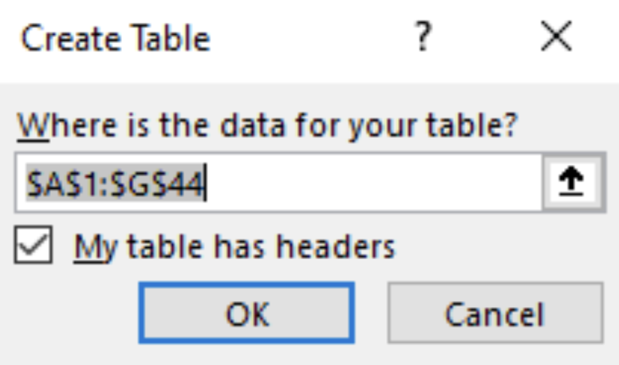
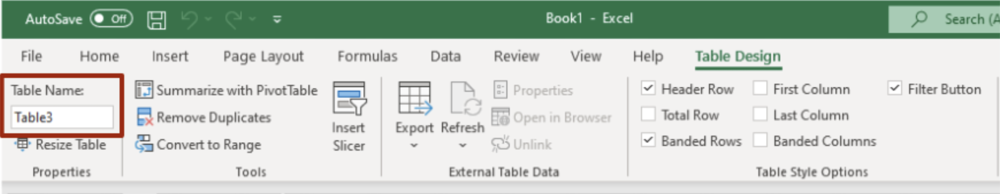

# Part I: Create the table

Create the table to be turned into a PivotTable by completing the following steps:

1. Name the active sheet by double clicking on the white tab at the bottom of the screen and typing in a name for the active sheet.

Figure 1. Name the Active Sheet. Note that the sheets that are not active appear gray.

 

2. Select the entire data set by clicking in the top leftmost corner cell of the dataset and dragging the mouse until the shaded square encompasses the entirety of the data.
See figure 2 for details.

Figure 2. Selecting all data. Data that is selected appears gray except for the top leftmost corner cell that was initially clicked. Some example data is excluded from this screenshot for formatting purposes.

 

3. Navigate to the toolbar menu at the top of the spreadsheet and select the Insert tab. See figure 3.

Figure 3. Insert Table.

 

4. Under the Insert tab, select the Table button shown in figure 3. Hitting Ctrl + T performs the same function. Once Table is selected, a prompt appears as shown in figure 4.

Figure 4. Create Table Prompt.

 

5. If the table being used already has headers like the example data shown in this document, check the box that says __My table has headers__ and click __OK__ as shown in figure 5.
If the table does __NOT__ have headers, leave the box that says My table has headers unchecked.
Click __OK__. The top row is automatically labeled __Column 1__, __Column 2__, __Column 3__, etc.
The automatic column names can be edited after clicking __OK__.

  
To change the table name, navigate to the Table Design tab and edit the table name under the table name section on the far left. See figure 5 for details.

Figure 5. Changing the table name in the Table Design menu.

 

The table is now created and ready to be formatted.

Continue on to [Part II: Format data in a table](format-data.md).