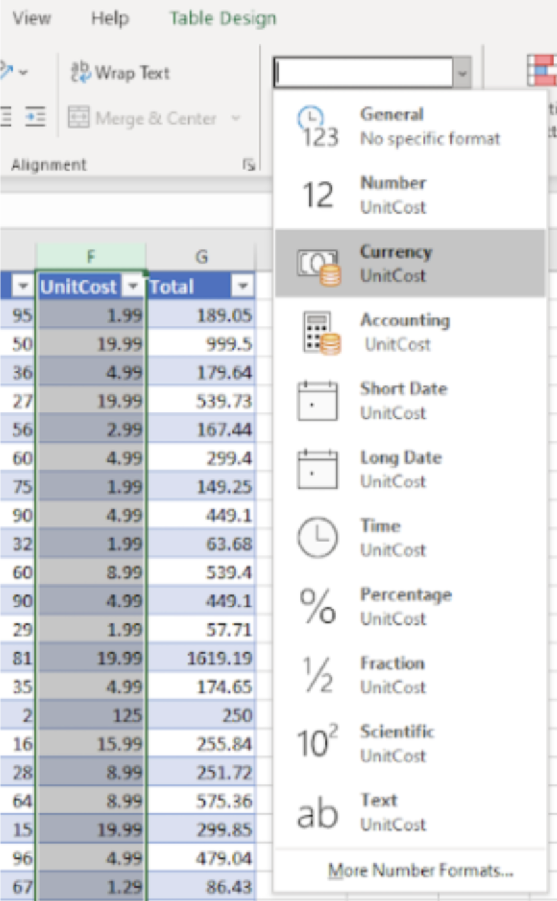

# Part II: Format data in a table

To create a PivotTable, data should first be recognized by Excel as the correct format.
Each column must therefore be reformatted to make sure that the data in each cell is read correctly.
Complete the following steps to format the data in a table.

1. Ensure that the header of each column is reflective of the type of data that it contains. For example, the UnitCost should be set to Currency so that Excel reads the data as a dollar amount. To change the field that a column is assigned to, click the letter above each column (A, B, C, etc.) to highlight the entire column. The selected column appears gray. See figure 6 for details.

Figure 6. Highlighting and formatting a column.

 
